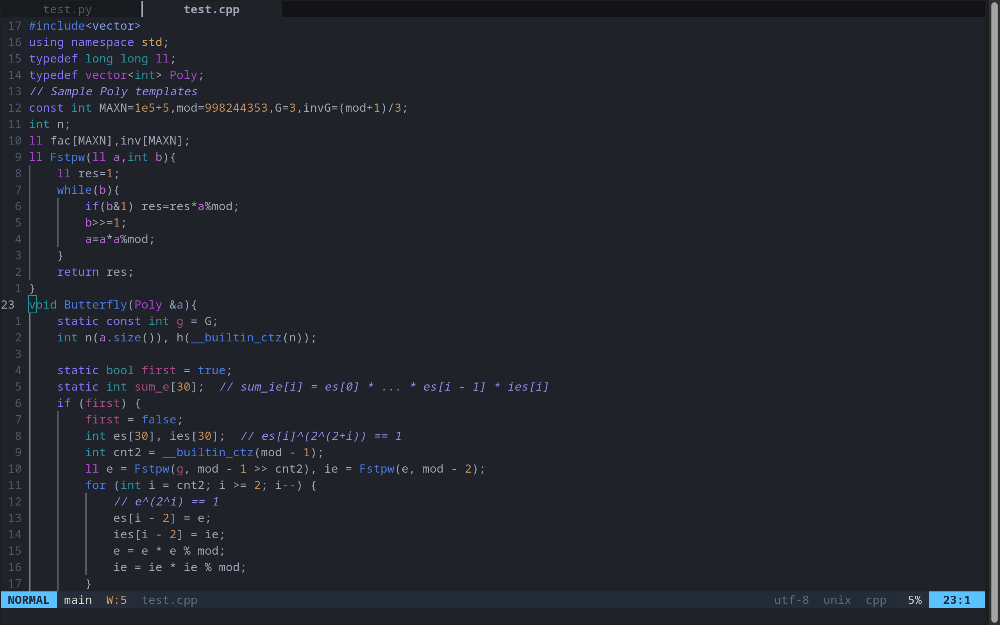
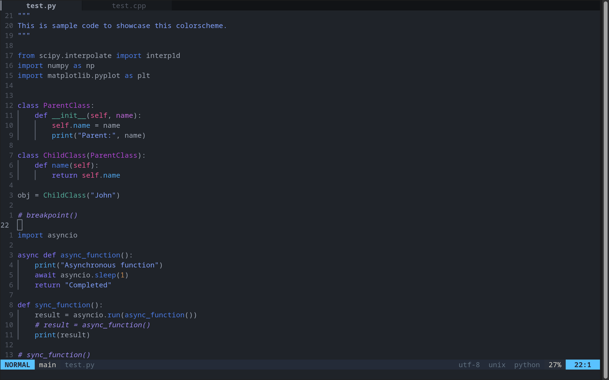
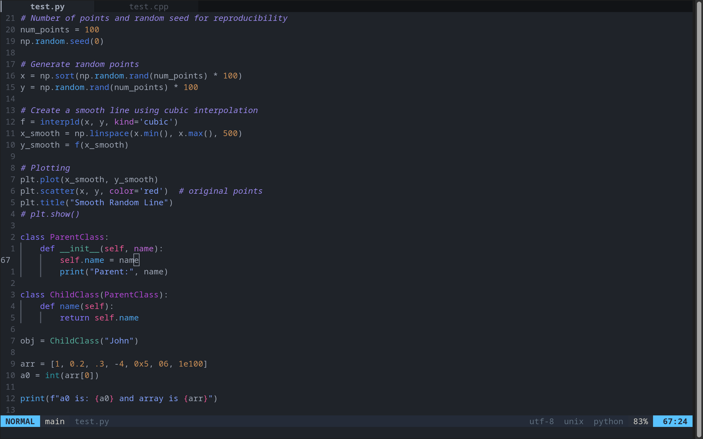
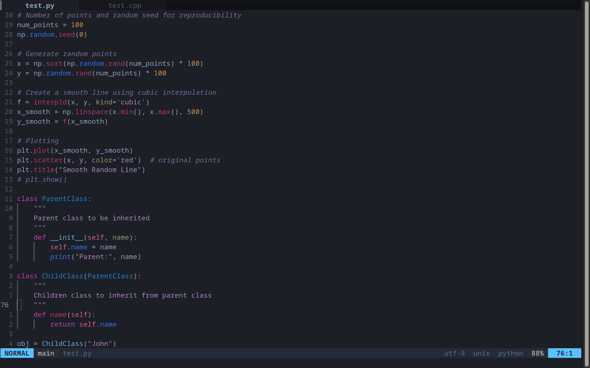
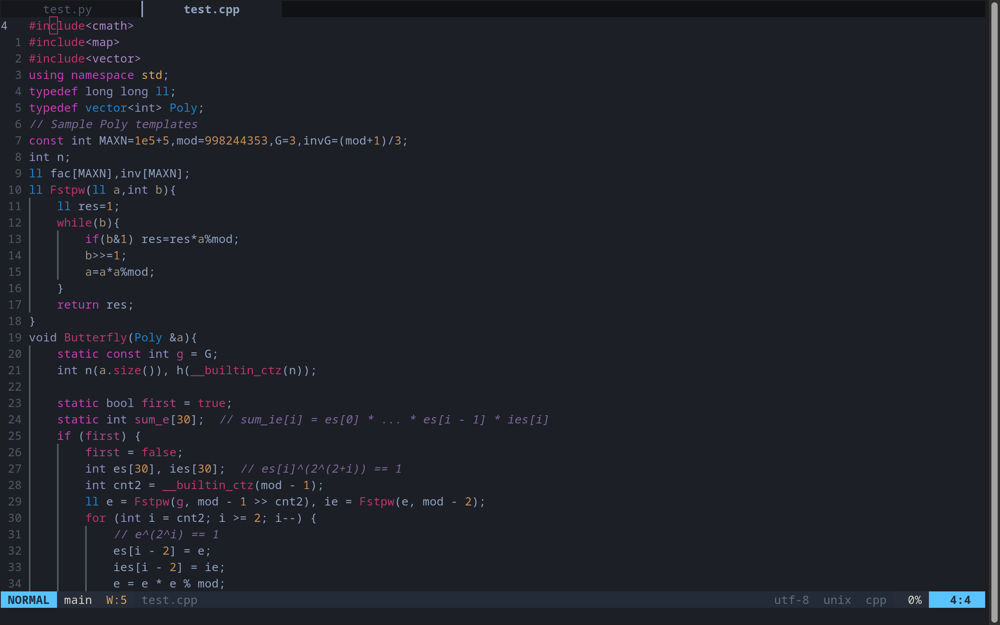
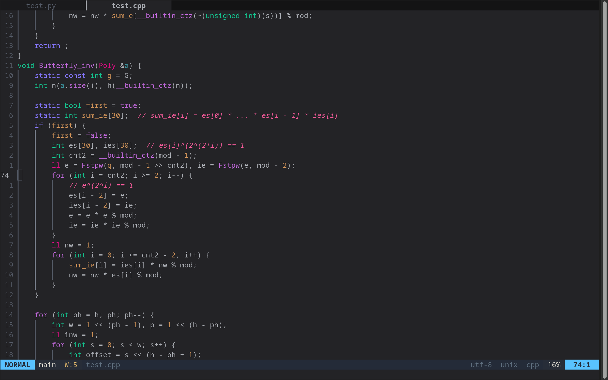
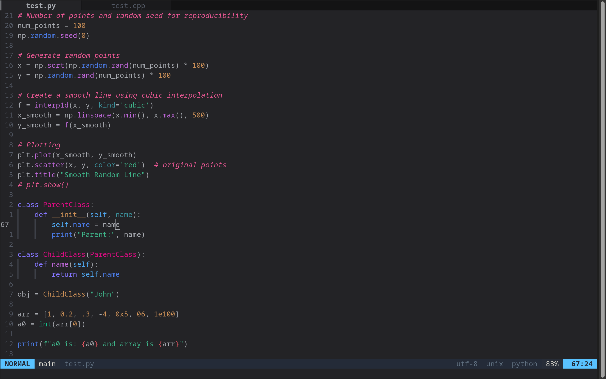

# Umbra

Colorscheme derived from [navarasu/onedark.nvim](https://github.com/navarasu/onedark.nvim). (Trying to) follow the style in Bayonetta

# Screenshots

## 🌕 **fullmoon** 🌕







-----

## 🩸 **impure** 🩸






-----

## 🍭 **newmoon** 🍭





-----

## 🌑 **lite** 🌑 (follows the style in onedark)


# Installation & Usage

Follow the instructions at [navarasu/onedark.nvim](https://github.com/navarasu/onedark.nvim).

The usage is almost the same (but some custom settings might be broken)

Treesitter & lsp recommended. 

Requires lastest release or nightly. Tip: In Ubuntu, use snap to install the latest release. The version in apt stable is too far behind, and unstable is too unstable.

#### Sample lua setup

```lua
local umbra = require('umbra')

umbra.setup {
	-- Main options --
	style = 'fullmoon',           -- Default theme style. Choose between 'dark', 'darker', 'cool', 'deep', 'warm', 'warmer' and 'light'
	transparent = false,          -- Show/hide background
	term_colors = true,           -- Change terminal color as per the selected theme style
	ending_tildes = false,        -- Show the end-of-buffer tildes. By default they are hidden
	cmp_itemkind_reverse = false, -- reverse item kind highlights in cmp menu

	-- toggle theme style ---
	toggle_style_key = '!',       -- keybind to toggle theme style. Leave it nil to disable it, or set it to a string, for example "<leader>ts"
	toggle_style_list = {
		'newmoon',
		'fullmoon',
        'impure',
		'lite',
		-- 'deep',
		-- 'warm',
		'warmer',
		-- 'dark',
		-- 'darker',
		'cool',
		'light',
	}, -- List of styles to toggle between

	-- Change code style ---
	-- Options are italic, bold, underline, none
	-- You can configure multiple style with comma separated, For e.g., keywords = 'italic,bold'
	code_style = {
		comments = 'italic',
		keywords = 'none',
		functions = 'none',
		strings = 'none',
		variables = 'none'
	},

	-- Lualine options --
	lualine = {
		transparent = false, -- lualine center bar transparency
	},

	-- Custom Highlights --
	colors = {}, -- Override default colors
	highlights = {
		-- For all options, see
	},                                   -- Override highlight groups

	-- Plugins Config --
	diagnostics = {
		darker = true,     -- darker colors for diagnostic
		undercurl = true,  -- use undercurl instead of underline for diagnostics
		background = true, -- use background color for virtual text
	},
}

umbra.load()
```

# Features

Beyond onedark, this colorscheme adds a few features:

1. Links every lsp hl-group to treesitter hl-group. In this way, custom highlight groups won't be overrided when lsp loads.
2. Custom color for parameter, builtin, telescope, ibl_indent, ibl_scope. (experimental, if custom highlights doesn't work, I will fix that)

# TODO

1. - [x] Released 'impure'

2. - [ ] Planning on release 'pure'
